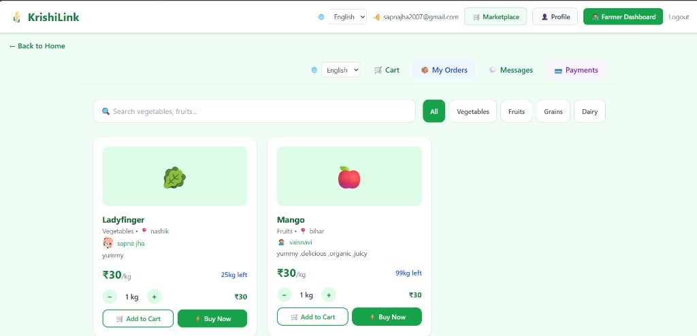
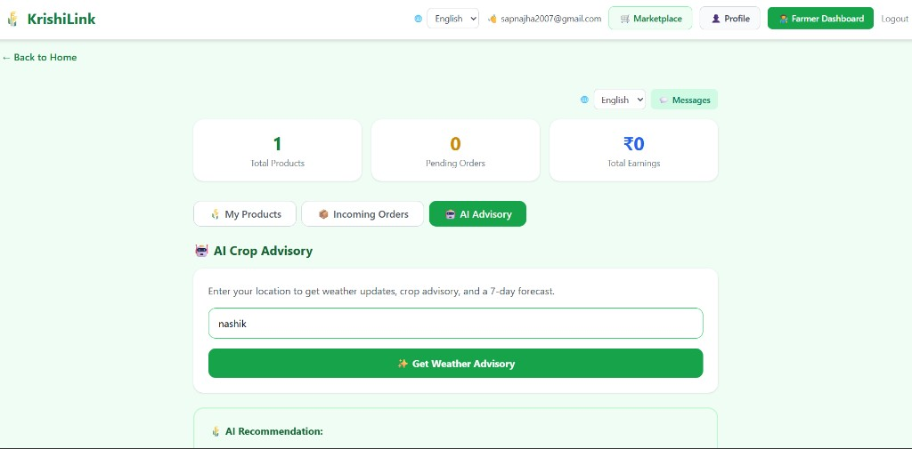
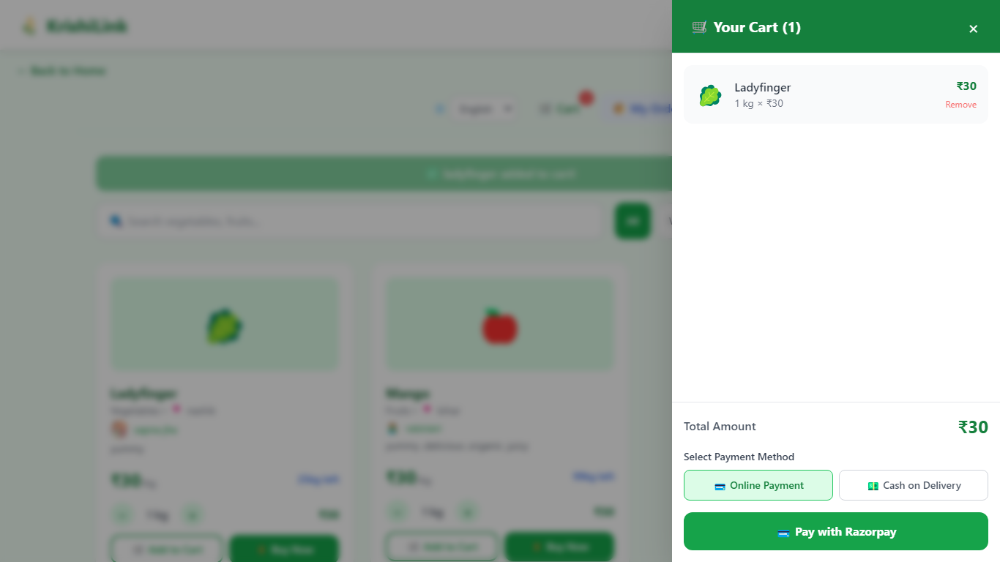
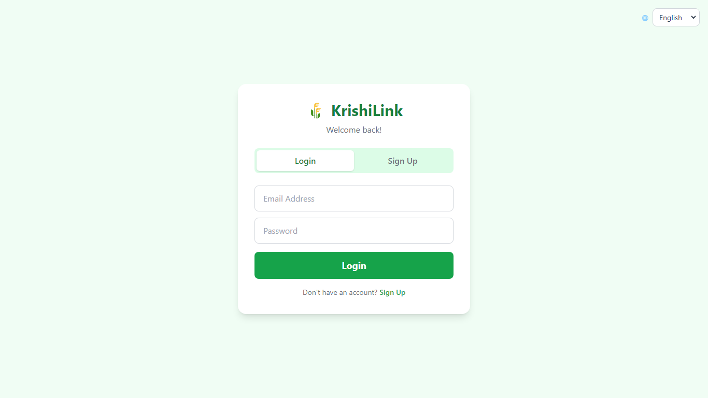
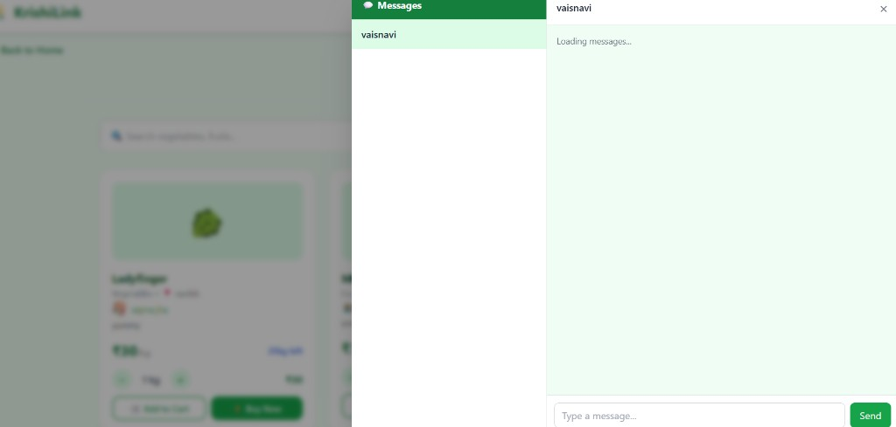
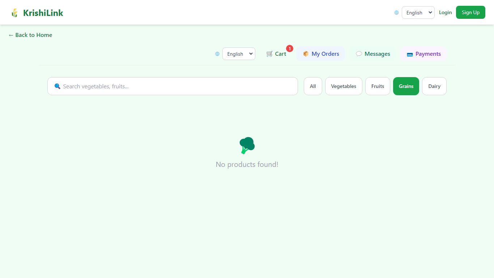

# 🌾 KrishiLink

<div align="center">


**Hyperlocal farmer-to-consumer marketplace for India**

Connect directly with local farmers — fresh produce, zero middlemen, multilingual, mobile-first.

[](https://krishilink-delta.vercel.app)
[](LICENSE)
[](https://react.dev)
[](https://supabase.com)
[](https://razorpay.com)

</div>

---

## 📸 Screenshots

> Screenshots live in [`docs/screenshots/`](docs/screenshots/). To update them, see [`docs/screenshots/README.md`](docs/screenshots/README.md) or run `npm run screenshots`.

| Marketplace | Farmer Dashboard | Checkout |
|:-----------:|:----------------:|:--------:|
|  |  |  |

| Auth | Chat | Admin Panel |
|:----:|:----:|:-----------:|
|  |  |  |

> 📷 **How to add screenshots:** Take screenshots of your live app, save them in `docs/screenshots/`, and they'll appear here automatically.

---

## ✨ Features

| Feature | Description |
|---------|-------------|
| 🛒 **Marketplace** | Browse, search, add to cart, Buy Now with Razorpay or COD |
| 👩‍🌾 **Farmer Profiles** | Every listing shows the farmer's name, photo, phone & location |
| 📊 **Farmer Dashboard** | Add/edit products, view orders, get weather advisory |
| 💬 **Direct Chat** | Real-time messaging between consumers and farmers |
| 🌐 **8 Languages** | English, Hindi, Punjabi, Gujarati, Maithili, Bhojpuri, Tamil, Telugu |
| 📱 **Mobile-First** | Cart & checkout as bottom sheets on small screens |
| 🔐 **Auth** | Email login/signup — register as Consumer or Farmer |
| 🛡️ **Admin Panel** | User management via environment-configured admin emails |

---

## 🧰 Tech Stack

| Layer | Technology |
|-------|------------|
| **Frontend** | React 18, Vite, Tailwind CSS |
| **Backend** | Node.js, Express (`src/server.js`) |
| **Database & Auth** | Supabase (PostgreSQL + Row Level Security) |
| **Storage** | Supabase Storage (farmer avatars & product images) |
| **Payments** | Razorpay (online) + Cash on Delivery |
| **Deployment** | Vercel (frontend) · Render (API) |
| **i18n** | Custom translation layer (`src/i18n/`) |

---

## 🚀 Quick Start

### Prerequisites

- Node.js 18+
- A [Supabase](https://supabase.com) project (free tier works)
- Razorpay test keys (for payment flow)

### 1 — Clone & install

```bash
git clone https://github.com/sapnajha757/krishilink.git
cd krishilink
npm install
```

### 2 — Configure environment

```bash
cp .env.example .env
```

Open `.env` and fill in your keys (see [full variable list](.env.example)):

```env
# Supabase
VITE_SUPABASE_URL=https://your-project.supabase.co
VITE_SUPABASE_ANON_KEY=your-anon-key

# Razorpay (server-side only)
RAZORPAY_KEY_ID=rzp_test_...
RAZORPAY_KEY_SECRET=your-secret

# Admin
VITE_ADMIN_EMAILS=admin@example.com
```

### 3 — Set up Supabase

```bash
# Run the schema in your Supabase SQL Editor:
# → supabase/schema.sql
```

Full guide: [`supabase/SETUP.md`](supabase/SETUP.md)

1. Create a Supabase project
2. Run [`supabase/schema.sql`](supabase/schema.sql) in the SQL Editor
3. Create a public Storage bucket named **`avatars`**
4. Add your deployed frontend URL to Auth → Redirect URLs

### 4 — Run locally

```bash
# Terminal 1 — React frontend (http://localhost:5173)
npm run dev

# Terminal 2 — Express API (http://localhost:4000)
npm run server
```

Open [http://localhost:5173](http://localhost:5173) 🎉

---

## 💳 Razorpay Setup

See the full guide: [`docs/RAZORPAY_SETUP.md`](docs/RAZORPAY_SETUP.md)

- Use **test mode** keys during development (no real charges)
- Switch to **live keys** before production
- Webhook endpoint: `POST /api/payment/verify`

---

## 🌍 Language Support

Use the **🌐 language dropdown** in the navbar — your choice is saved in `localStorage`.

| Code | Language |
|------|----------|
| `en` | English |
| `hi` | Hindi (हिन्दी) |
| `pa` | Punjabi (ਪੰਜਾਬੀ) |
| `gu` | Gujarati (ગુજરાતી) |
| `mai` | Maithili (मैथिली) |
| `bho` | Bhojpuri (भोजपुरी) |
| `ta` | Tamil (தமிழ்) |
| `te` | Telugu (తెలుగు) |

**Adding a new language:**

1. Create `src/i18n/locales/<code>.js`
2. Register it in `src/i18n/translations.js`
3. Add to the dropdown in `src/i18n/languages.js`

---

## 📁 Project Structure

```
krishilink/
├── src/
│   ├── App.jsx              # Root app & routing
│   ├── Auth.jsx             # Login / sign up
│   ├── Profile.jsx          # Farmer profile page
│   ├── Marketplace.jsx      # Shop, cart, checkout
│   ├── FarmerDashboard.jsx  # Farmer product & order management
│   ├── AdminPanel.jsx       # Admin user management
│   ├── ChatPanel.jsx        # Consumer ↔ farmer messaging
│   ├── Loading.jsx          # Shared spinner component
│   ├── server.js            # Express API (payments, weather)
│   ├── supabase.js          # Supabase client
│   └── i18n/
│       ├── translations.js
│       ├── languages.js
│       └── locales/         # Per-language JSON files
├── supabase/
│   ├── schema.sql           # Tables, RLS, storage policies
│   └── SETUP.md
├── docs/
│   ├── DEPLOY.md
│   ├── RAZORPAY_SETUP.md
│   └── screenshots/         # ← add your screenshots here
├── public/
├── .env.example
├── vercel.json              # Vercel frontend config
├── render.yaml              # Render API blueprint
└── package.json
```

---

## 📜 Scripts

| Command | Description |
|---------|-------------|
| `npm run dev` | Start Vite dev server on :5173 |
| `npm run build` | Production build → `dist/` |
| `npm run preview` | Preview the production build |
| `npm run server` | Start Express API on :4000 |

---

## 🚢 Deploying to Production

Full checklist: [`docs/DEPLOY.md`](docs/DEPLOY.md)

| Service | What it hosts | Config file |
|----------|-----------------|--------------|
| [Vercel](https://vercel.com) | React frontend | `vercel.json` |
| [Render](https://render.com) | Express API | `render.yaml` |
| [Supabase](https://supabase.com) | DB, Auth, Storage | `supabase/schema.sql` |

> ⚠️ Set all `VITE_*` env vars in Vercel dashboard, and server-only secrets in Render — never commit `.env` to Git.

---

## 🤝 Contributing

Contributions are welcome! Here's how:

```bash
# 1. Fork the repo and clone your fork
git clone https://github.com/<your-username>/krishilink.git

# 2. Create a feature branch
git checkout -b feature/your-feature-name

# 3. Make your changes and commit
git commit -m "feat: add your feature"

# 4. Push and open a Pull Request
git push origin feature/your-feature-name
```

Please open an issue first for major changes.

---

## 📄 License

[MIT](LICENSE) — built for learning and local farm-to-table commerce in India.

---

## 👩‍💻 Team — Tech Chaos

| Name | GitHub | Email |
|------|---------|-------|
| **Sapna Jha** | [@sapnajha757](https://github.com/sapnajha757) | sapnajha2007@gmail.com |
| **Vaishnavi** | [@vaishnavijha006-hub](https://github.com/vaishnavijha006-hub) | vaishnavijha006@gmail.com |

---

<div align="center">

Built with ❤️ by **Team Tech Chaos** for Indian farmers

[Live Demo](https://krishilink-delta.vercel.app) · [Report a Bug](https://github.com/sapnajha757/krishilink/issues) · [Request a Feature](https://github.com/sapnajha757/krishilink/issues)

</div>
